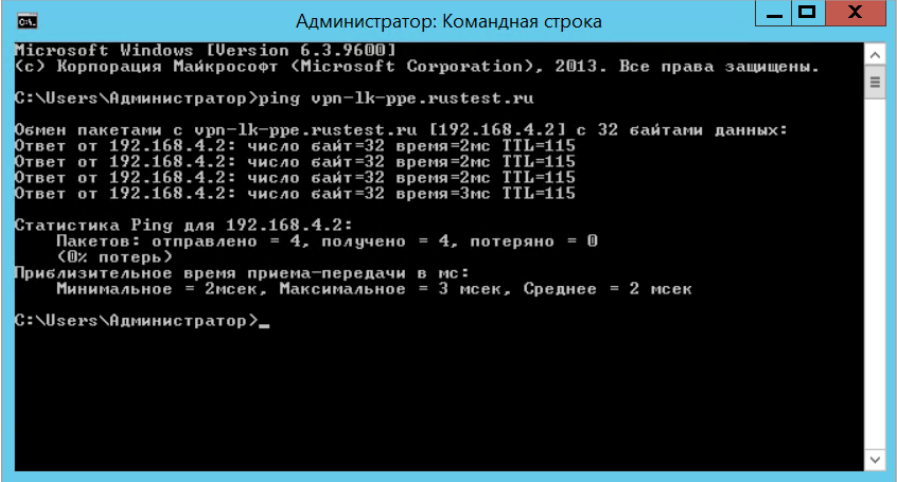

Астра Линукс и Альт Образование

Если ЛК ППЭ не доступна, необходимо проверить следующее:

-  Проверка сети, подключены ли к интернету

-  Проверка статуса засекреченной сети в VipNet Клиент.

-  Очистить кэш браузера

-  Проверить файл hosts.

   Для этого, необходимо пройти в «Мой компьютер» или «Домашняя папка» в поиске ввести: «etc». Необходимо найти файл под названием «hosts» и открыть его.

   Если данных ip адресов нет, просим прописать их.

   Обращаем внимание! прописываться данные ip адреса должны после адреса localhost 127.0.0.1

   192\.168.4.2 [vpn-lk-ppe.rustest.ru](http://vpn-lk-ppe.rustest.ru)

   192\.168.4.2 [vpn-auth-ppe.rustest.ru](http://vpn-auth-ppe.rustest.ru)

   192\.168.4.2 [vpn-api-ppe.rustest.ru](http://vpn-api-ppe.rustest.ru)

   192\.168.4.8 [vpn-storage-ppe.rustest.ru](http://vpn-storage-ppe.rustest.ru)

   192\.168.4.2 [vpn-test-lk-ppe.rustest.ru](http://vpn-test-lk-ppe.rustest.ru)

   192\.168.4.2 [vpn-test-auth-ppe.rustest.ru](http://vpn-test-auth-ppe.rustest.ru)

   192\.168.4.2 [vpn-test-api-ppe.rustest.ru](http://vpn-test-api-ppe.rustest.ru)

   192\.168.4.8 [vpn-test-storage-ppe.rustest.ru](http://vpn-test-storage-ppe.rustest.ru)

-  Необходимо пропинговать один из адресов, а именно: ping [vpn-lk-ppe.rustest.ru](http://vpn-lk-ppe.rustest.ru)

   При успешном пинговании должно высветиться следующие:

   {width=897px height=482px}

-  Просим повторно пройти в ЛК ППЭ.