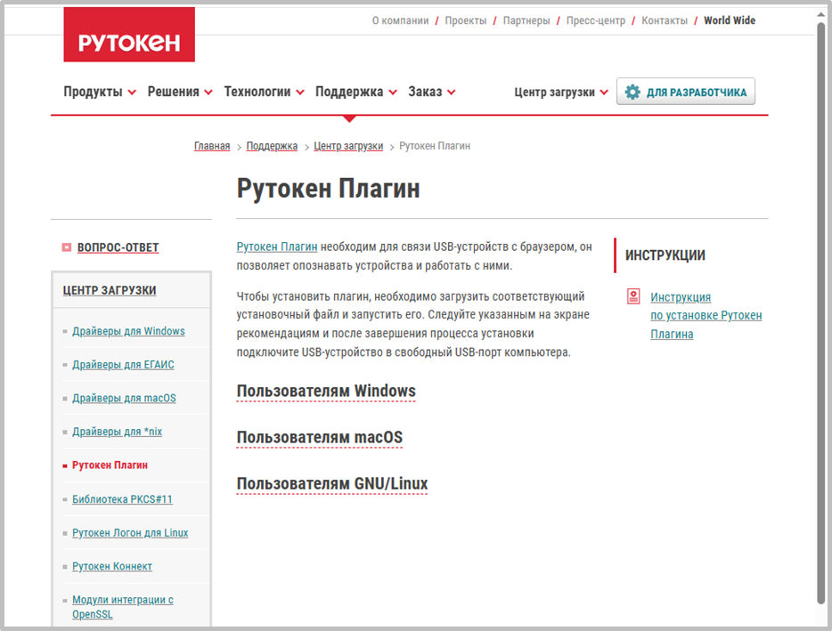
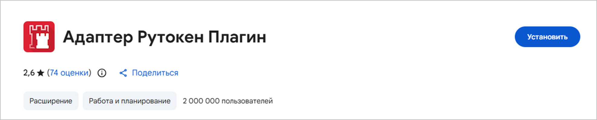

**Шаг 1.** Установите Рутокен Плагин <https://www.rutoken.ru/support/download/rutoken-plugin>

{width=934px height=709px}

**Шаг 2.** Откройте интернет-магазин расширений Chrome <https://chromewebstore.google.com/?hl=RU&authuser=1> и установите Адаптер Рутокен Плагин

*\*Следует использовать подключение к сети Интернет без ограничений ЕСПД*

{width=1972px height=399px}

**Шаг 3.** Перезапустите используемый браузер (Яндекс.Браузер или Chromium)