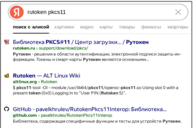
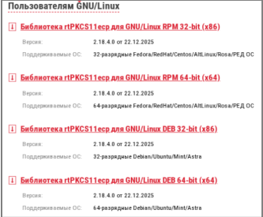
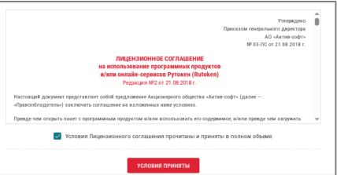
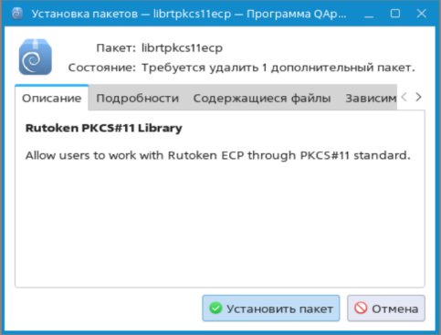
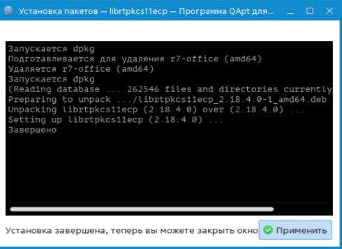
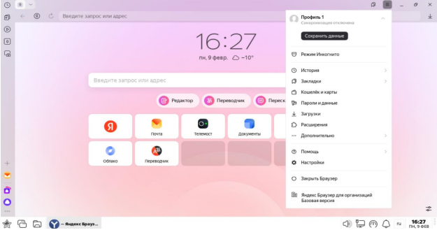
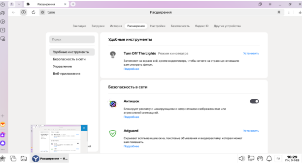
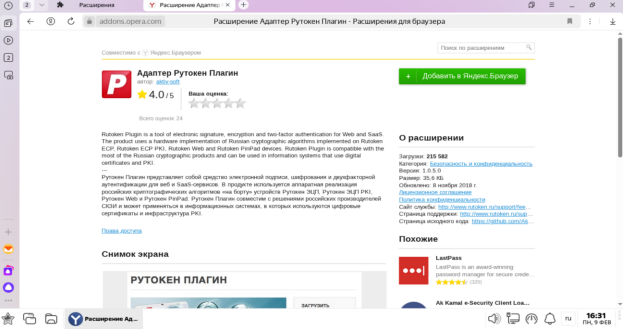
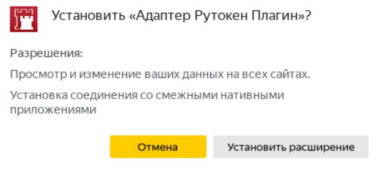

Установка RuToken PKCS#11 и Плагина <https://www.rutoken.ru/support/download/pkcs/?ysclid=ml7vkylbnn4574445> В браузере заходим на официальный сайт Рутокен

{width=379px height=253px}

Вам необходим раздел «Пользователям GNU/Linux» И установливаете 64-битную версию deb файл

{width=333px height=275px}

Ознакамливаемся и подтверждаем лицензионное соглашение

{width=428px height=223px}

Кликаем два раза по загруженному файлу

{width=618px height=67px}

Нажимаем на «Установить пакет»

{width=483px height=367px}

Пакет установлен, нажимаем «Применить»

{width=490px height=357px}

Далее, требуется добавить плагин в браузер. Переходим в «Расширение»

{width=625px height=329px}

Переходим в «Каталог расширений»

{width=613px height=342px}

В поиске вводим «Рутокен» и устанавливаем «Адаптер Рутокен Плагин». Нажимаем на «Добавить в Яндекс.Браузер»

{width=624px height=331px}

Устанавливаем расширение

{width=632px height=279px}

Расширение добавлено. Можем продолжать работу