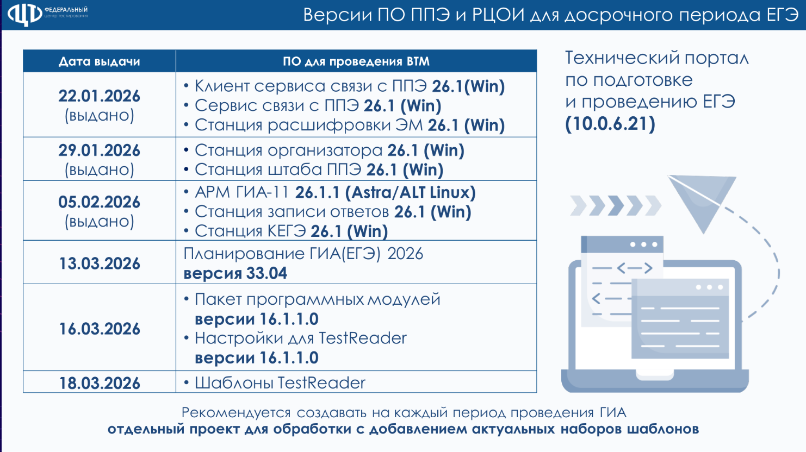

<table header="row">
<colgroup><col width="84"/><col width="339"/><col width="567"/></colgroup>
<tr>
<td>

№ п/п

</td>
<td>

Мероприятие

</td>
<td>

Используемая ОС и ПО

</td>
</tr>
<tr>
<td>

1\.

</td>
<td>

РТМ, ВТМ, Досрочный период

</td>
<td>

**OC**: Astra Linux 1.8.4 (Орёл)

**Версия ПО «АРМ ГИА 11 в ППЭ**»: 26.1.1 (\*. deb)

**Выдано**: 05.02.2026

**ОС**: АльтОбразование 10.3, 10.4, 11

**Версия ПО «АРМ ГИА 11 в ППЭ»**: 26.1.1 (\*. rpm)

**Выдано**: 05.02.2026

**ОС**: Windows

**Версия ПО «Станция записи ответов», «Станция КЕГЭ»**: 26.1

**Выдано**: 05.02.2026

**Версия ПО «Станция для печати (включает станцию организатора)»,**

**«Станция штаба ППЭ»**: 26.1

**Выдано**: 29.01.2026

</td>
</tr>
<tr>
<td>

2\.

</td>
<td>

ПО для обработки РЦОИ ВТМ 04.03.26

</td>
<td>

ФГБУ «ФЦТ» информирует, что 02.03.26 на технологическом портале по подготовке и проведению ЕГЭ (<http://10.0.6.21>) в разделе «Программное обеспечение/Тренировочные мероприятия» размещены архивы для ВТМ 04.03.2026:

-  TestReader 5.5_v1520 – IXORA TestReader 5.5 версии 1520

-  Шаблоны ВТМ ЕГЭ\_2026.03.04 – шаблоны для обработки бланков с одной проверкой

-  USE55.ReportsFiller – обновление отчетов ст. Менеджер отчетов IXORA TestReader

-  Ixora_TestReader\_Станция\_контроля\_верификации\_2.0 – Станция контроля верификации 2.0

-  ause25-26office_16.5.0.0 – пакет программных модулей АПП-11

Дополнительно сообщаем, что для обработки материалов ВТМ 04.03.2026 необходимо использовать настройки  версии 16.5.1.0 (были размещены 18.02.2026)

</td>
</tr>
<tr>
<td>

3\. 

</td>
<td>

ПО для РЦОИ

</td>
<td>

ПО «Планирование ГИА (ЕГЭ) 2026» версии **33\.04** добавлены следующие функциональные возможности:

1. Доступна рассадка для экзаменов ГИА-11 досрочного этапа;

2. Обновлены формы 18-МАШ и ППЭ-21

По размещено 13.03.26 на технологическом портале по подготовке и проведению ЕГЭ (<http://10.0.6.21>), в разделе «**Программное обеспечение**».

</td>
</tr>
</table>

{width=1482px height=832px}