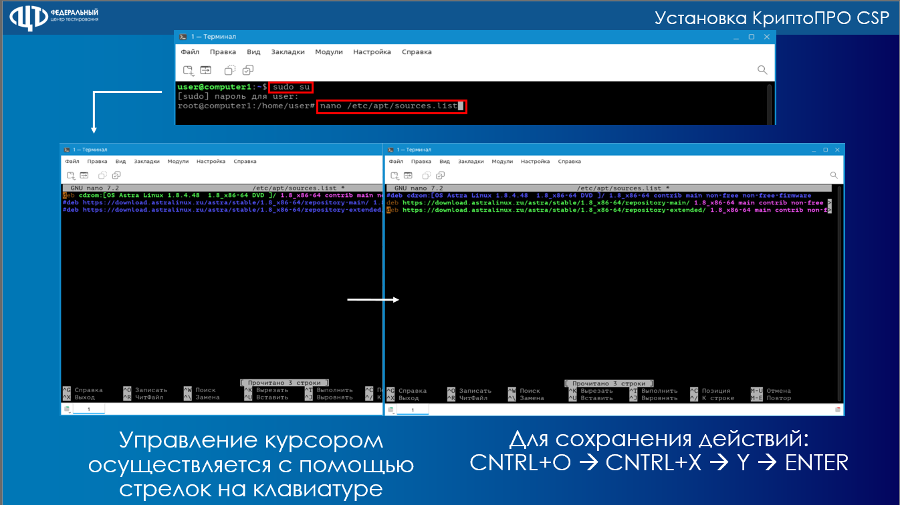

## Для Astra Linux SE 1.8.4

1. Уточните список неудовлетворенных зависимостей

   <table header="row">
   <colgroup><col width="365.5"/><col width="372"/></colgroup>
   <tr>
   <td align="center">

   GUI-интерфейс

   </td>
   <td align="center">

   Терминал

   </td>
   </tr>
   <tr>
   <td align="center">

   <image src="./neudovletvorennye-zavisimosti.png" crop="41.13971177318869,24.637681159420293,32.57396533360981,39.46488294314381" width="1855px" height="1004px" float="center"/>

   </td>
   <td align="center">

   <image src="./neudovletvorennye-zavisimosti-2.png" crop="1.4304455565813128,2.787068004459309,47.7644429328021,41.248606465997774" scale="100" width="2227px" height="1243px" float="center"/>

   </td>
   </tr>
   </table>

2. Уточните какие подключены репозитории. Направьте содержимое файла **sources.list**, для этого откройте его в текстовом редакторе **nano** командой: `sudo nano /etc/apt/sources.list`

3. Исправьте ошибки в зависимостях установив необходимые пакеты, зависимости с которыми не удовлетворены.

   Для этого необходимо:

   1. Привести в соответствие файл sources.list, в файле должны быть указаны хотя бы два интернет-репозитория Astra Linux. Пример:

      `#deb cdrom:[OS Astra Linux 1.8.4.48  1.8_x86-64 DVD ]/ 1.8_x86-64 contrib main non-free non-free-firmware`

      `deb <https://download.astralinux.ru/astra/stable/1.8_x86-64/repository-main/> 1\.8_x86-64 main contrib non-free non-free-firmware`

      `deb <https://download.astralinux.ru/astra/stable/1.8_x86-64/repository-extended/> 1\.8_x86-64 main contrib non-free non-free-firmware`

      {width=1346px height=756px}

   2. Сохранить файл, для текстового редактора **nano** нажмите комбинацию клавиш: **ctrl + o**

   3. Закройте файл, для текстового редактора **nano** нажмите комбинацию клавиш: **ctrl + x**

   4. Обновите «подключенные» репозитории командой: `sudo apt update`

4. Для установки недостающих пакетов последовательно выполните команду:

   1. `sudo apt install *наименование пакета*` *(для каждого недостающего пакета индивидуально)*

5. Выполните установку АРМ ГИА-11