## **Альт Образование:**

**Файл инструкции:** [Инструкция по установке ОС Linux ATL Образования.docx](<./Инструкция по установке ОС Linux ATL Образования.docx>)

Инструкция по установке ОС Linux ATL Образования

Подключите USB накопитель с загрузочным содержимым к компьютеру.

Включите персональный компьютер и последовательно и многократно нажмите клавишу F9 для активации меню загрузки (Boot Manager).

<image src="./ustanovka-os.png" crop="0,0,100,100" scale="81" width="792px" height="495px" float="center"/>

В представленном списке выберите ваш USB накопитель. Для инициирования процесса установки нажмите клавишу «Enter».

<image src="./ustanovka-os-2.png" crop="0,0,100,100" scale="80" width="833px" height="522px" float="center"/>

В выборочном меню выбираем iso образ – Альт Education, (версии 10.3, 10.4, 11). Выбираем образ клавишей «Enter».

<image src="./ustanovka-os-3.png" crop="0,0,100,100" scale="81" width="833px" height="439px" float="center"/>

Рисунок 3

Загрузочный носитель предоставляет выбор установки ОС:

-  Boot in normal mode – загрузка в обычном режиме.

-  Boot in grub2 mode – позволяет выбрать параметры загрузки. В основном данный режим выбирают, если пользователь хочет установить, как вторую ОС.

После этого будет совершена стандартная загрузка ОС.

<image src="./ustanovka-os-4.png" crop="0,0,100,100" scale="81" width="753px" height="400px" float="center"/>

Для инициирования процесса установки нажмите клавишу «Enter».

<image src="./ustanovka-os-5.png" crop="0,0,100,100" scale="81" width="688px" height="503px" float="center"/>

Выберите язык интерфейса и ознакомьтесь с лицензионным соглашением.

<image src="./ustanovka-os-6.png" crop="0,0,100,100" scale="82" width="974px" height="589px" float="center"/>

Настройте параметры даты и времени.

<image src="./ustanovka-os-7.png" crop="0,0,100,100" scale="82" width="980px" height="590px" float="center"/>

В процессе выбора метода установки операционной системы рекомендуется воспользоваться опцией «Удалить все разделы и создать автоматически».

<image src="./ustanovka-os-8.png" crop="0,0,100,100" scale="84" width="944px" height="564px" float="center"/>

Для установки ОС Альт Linux в качестве второй ОС на данном устройстве выберите опцию «Использовать неразмеченное дисковое пространство».

<image src="./ustanovka-os-9.png" crop="0,0,100,100" scale="85" width="980px" height="587px" float="center"/>

Предложение о загрузке дополнительных программных компонентов. Для ознакомления с доступными пакетами установите флажок в опции «Показать составы группы», после чего выберите интересующий дополнительный пакет.

<image src="./ustanovka-os-10.png" crop="0,0,100,100" scale="85" width="980px" height="524px" float="center"/>

Нажмите кнопку «Далее».

<image src="./ustanovka-os-11.png" crop="0,0,100,100" scale="84" width="974px" height="589px" float="center"/>

Пропустите этап конфигурации сети и нажмите кнопку «Далее».

<image src="./ustanovka-os-12.png" crop="0,0,100,100" scale="85" width="974px" height="591px" float="center"/>

Установите пароль для суперпользователя (администратора).

<image src="./ustanovka-os-13.png" crop="0,0,100,100" scale="85" width="974px" height="518px" float="center"/>

Создайте пользовательский аккаунт.

<image src="./ustanovka-os-14.png" crop="0,0,100,100" scale="85" width="974px" height="514px" float="center"/>

Завершите процесс установки.

<image src="./ustanovka-os-15.png" crop="0,0,100,100" scale="86" width="955px" height="597px" float="center"/>

При перезагрузке, в случае автоматического открытия загрузочного носителя, отключите персональный компьютер.

Извлеките загрузочный носитель.

Включите персональный компьютер.

**Важно!** В дальнейшем при работе с USB накопителем обязательно корректно выполните процедуру его размонтирования перед извлечением из персонального компьютера. Несоблюдение данной процедуры может привести к повреждению USB накопителя и его последующей неработоспособности.

## ОС Astra Linux Special Edition

**Файл инструкции:** [Как установить ОС Астра Линукс.docx](<./Как установить ОС Астра Линукс.docx>)

Установка ОС Astra Linux Special Edition

Рекомендуемые системные требования:

-  процессор с архитектурой x86-64 (AMD, Intel);

-  оперативная память -- не менее 4 ГБ;

-  объем свободного дискового пространства -- не менее 16 ГБ;

-  устройство для чтения DVD-дисков или USB-интерфейс;

-  стандартный монитор;

-  совместимость с оборудованием.

Операционная система может быть установлена:

-  Через графический интерфейс пользователя (GUI)

-  Через командную строку (терминал).

Для установки рекомендуем использовать графический интерфейс пользователя.

1. Выберите «Графическая установка ОС» (рис. 1) и нажмите клавишу enter.

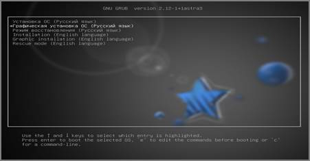

(Рисунок 1)

1. Изучите текст лицензии, пролистайте его до заключительной части и выберите опцию «Да» и нажмите продолжить (Рис. 2):

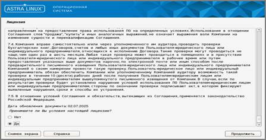

(Рисунок 2)

1. На следующем этапе необходимо выбрать комбинацию клавиш для смены языка, рекомендуем выбрать: Alt+Shift и нажмите «Продолжить»:

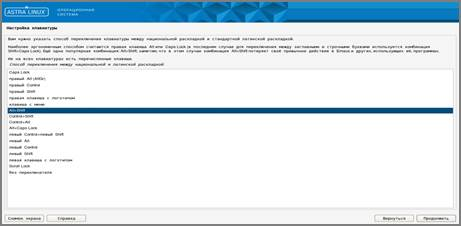

(Рисунок 3)

1. После инсталляции программных компонентов операционная система запрашивает присвоение имени компьютеру, например, user.

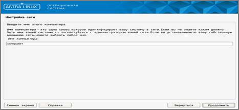

(Рисунок 4)

1. Следующее поле «Имя домена» - необязательно для заполнения. Далее нажимаем «Продолжить».

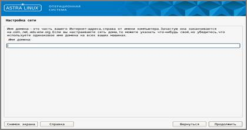

(Рисунок 5)

1. На следующем этапе необходимо присвоить имя пользователю с правами администратора.

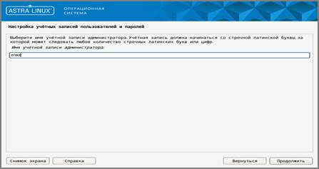

(Рисунок 6)

1. Далее требуется сформировать пароль для пользователя с привилегиями администратора (root).

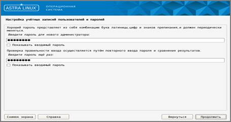

(Рисунок 7)

1. Далее необходимо выполнить настройку времени и выбор часового пояса. В данном случае выбран часовой пояс Москвы.

Обращаем внимание, все три часовых пояса для Республики Саха.

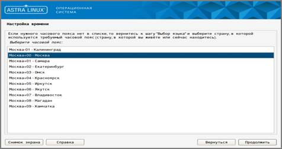

(рисунок 8)

1. Далее необходимо произвести разметку диска. Рекомендуется выбрать первый вариант и нажать на кнопку «Продолжить».

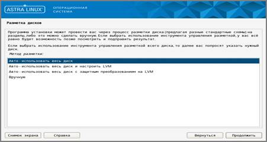

(Рисунок 9)

1. В данном контексте рассматривается вопрос выбора носителя информации для процесса разметки. Обратите внимание, требуется установить операционную систему на жесткий диск, а не на USB - накопитель

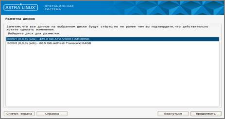

(Рисунок 10)

1. На данном этапе выбираем «Все файлы в одном разделе» и нажимаем «Продолжить»

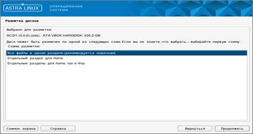

(Рисунок 11)

1. Далее выбираем «Закончить разметку и записать изменения на диск», после чего нажимаем «Продолжить»

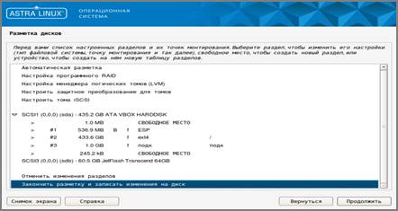

(Рисунок 12)

1. В пункте «Записать изменения на диск?», необходимо нажать «Да» и затем «Продолжить».

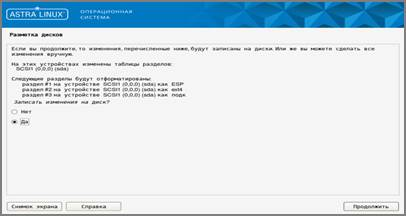

(Рисунок 13)

1. Далее выполняется инициация процедуры установки.

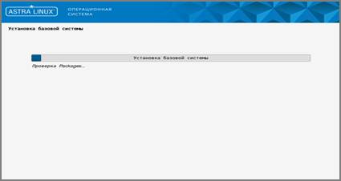

(Рисунок 14)

Версия ядра предпочтительнее «linux-6.1-generic», так как было выполнено больше работ.

1. Через время, ядро автоматически обновится до новой версии.

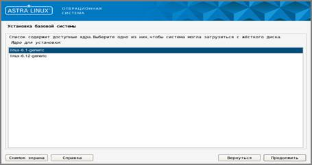

(Рисунок 15)

1. Операционная система предлагает выбор дополнительного программного обеспечения. Необходимо выбрать опцию "Средства удаленного подключения SSH" и оставить все остальные параметры по умолчанию.

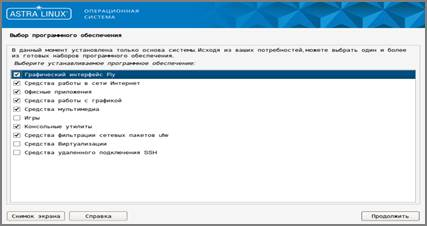

(Рисунок 16)

Необходимо определить степень защиты. Обратите внимание, требуется выбрать **Базовый уровень защищенности «Орел»**

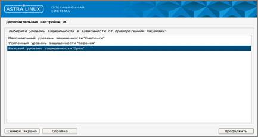

(Рисунок 17)

В разделе дополнительных настроек рекомендуется оставить все параметры в их первоначальных значениях.

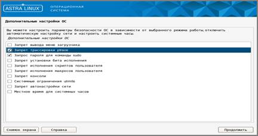

(Рисунок 18)

Ввиду того, что операционная система будет являться основной и единственной на данном устройстве, необходимо произвести установку загрузчика GRUB. Данного окна у вас может и не появится.

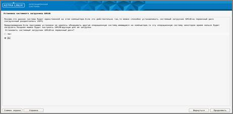

(Рисунок 19)

Установка пароля для GRUB.

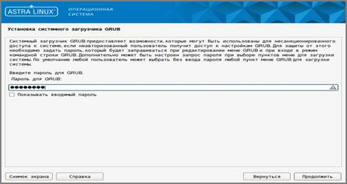

(Рисунок 20)

Подтверждаем аутентификационный код

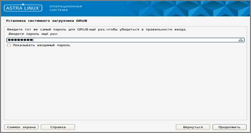

(Рисунок 21)

Завершаем процесс установки

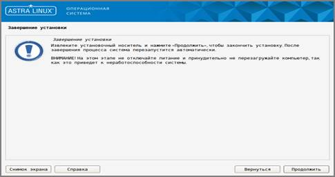

(Рисунок 22)

Ожидаем завершения процесса полной загрузки.

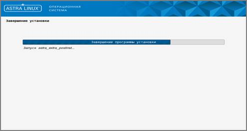

(Рисунок 23)